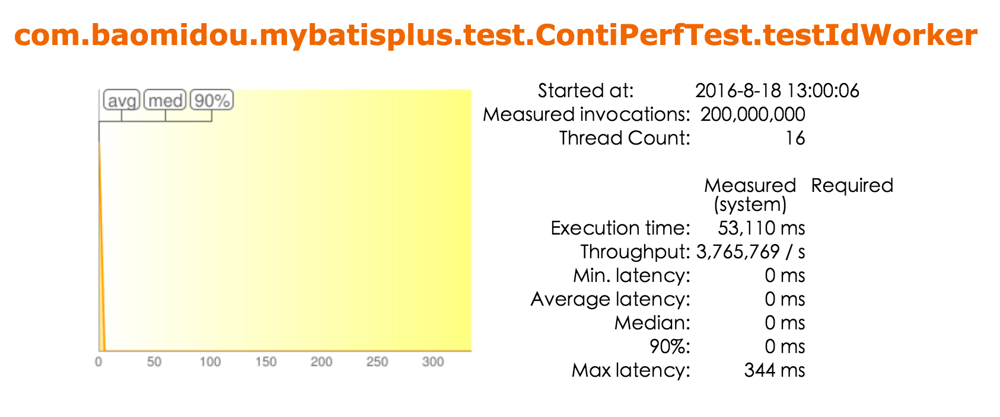

#分布式高效ID (sequence)

##简介
分布式高效 ID 算法(sequence), 基于 Snowflake 实现64位自增 ID 算法。

Twitter-Snowflake算法产生的背景相当简单，为了满足Twitter每秒上万条消息的请求，每条消息都必须分配一条唯一的id，这些id还需要一些大致的顺序（方便客户端排序），并且在分布式系统中不同机器产生的id必须不同。

性能测试数据：

##Snowflake算法核心
把时间戳，工作机器id，序列号组合在一起。

除了最高位bit标记为不可用以外，其余三组bit占位均可浮动，看具体的业务需求而定。默认情况下41bit的时间戳可以支持该算法使用到2082年，10bit的工作机器id可以支持1023台机器，序列号支持1毫秒产生4095个自增序列id。下文会具体分析。

##Snowflake – 时间戳
这里时间戳的细度是毫秒级，具体代码如下，建议使用64位linux系统机器，因为有vdso，gettimeofday()在用户态就可以完成操作，减少了进入内核态的损耗。

##Snowflake – 工作机器id
严格意义上来说这个bit段的使用可以是进程级，机器级的话你可以使用MAC地址来唯一标示工作机器，工作进程级可以使用IP+Path来区分工作进程。如果工作机器比较少，可以使用配置文件来设置这个id是一个不错的选择，如果机器过多配置文件的维护是一个灾难性的事情。

##Snowflake – 序列号
序列号就是一系列的自增id（多线程建议使用atomic），为了处理在同一毫秒内需要给多条消息分配id，若同一毫秒把序列号用完了，则“等待至下一毫秒”。

